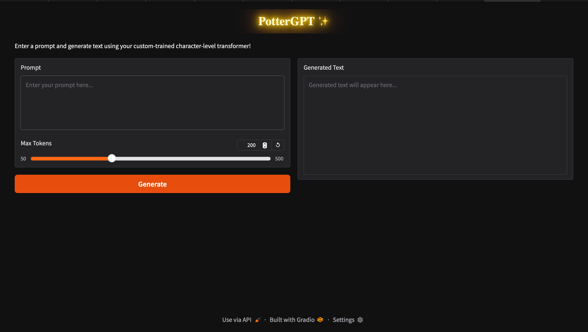

# Harry Potter Character-level Transformer Text Generator

This project trains a character-level transformer (GPT-style) model on the text of "Harry Potter and the Sorcerer's Stone" and deploys it as an interactive web app using Gradio.

## Features

- Character-level language modeling using PyTorch
- Transformer architecture with configurable hyperparameters
- Easy training and evaluation
- Gradio web interface for text generation with custom prompt and token count
- Custom CSS for stylish UI

## Setup

1. **Clone the repository** and navigate to the project folder.

2. **Install dependencies:**
    ```bash
    pip install -r requirements.txt
    ```

3. **Prepare the dataset:**
    - Place `01 Harry Potter and the Sorcerers Stone.txt` in the project directory.

4. **Train the model:**
    ```bash
    python train_model.py
    ```
    - This will save a trained model as `harry_model.pt`.

5. **Run the Gradio app:**
    ```bash
    python gradio-deploy.py
    ```
    - Open the provided local URL in your browser.

## Usage

- Enter a prompt (e.g., `Harry looked at`) in the textbox.
- Adjust the "Max Tokens" slider to control output length.
- Click **Generate** to produce text in the style of the book.

## Files

- `v2.py` — Model, data loading, and utility functions.
- `train_model.py` — Training script.
- `gradio-deploy.py` — Gradio web app for text generation.
- `requirements.txt` — Python dependencies.

## Example



---

**Enjoy generating Harry Potter-style text!**
